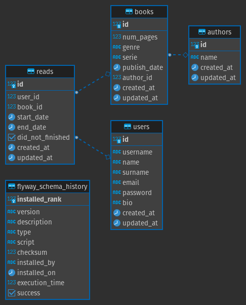

# Hobby Keeping

API to record books that you read and games you played!

Made with Kotlin and Spring Framework

This is a study project, the objective is to create a APP to save my read and game list.

## Current Database Model




## Run Locally

Clone the project

```bash
  git clone https://github.com/wilboron/hobby-keeping.git
```

Go to the project directory

```bash
  cd hobby-keeping
```


Start the server (Gradle will download required depedencies)

```bash
  ./gradlew bootRun
```


## Authors

- [@wilboron](https://github.com/wilboron)


## License

[Apache License 2.0](https://choosealicense.com/licenses/apache-2.0/)

